# SynthRender

<p align="center">
    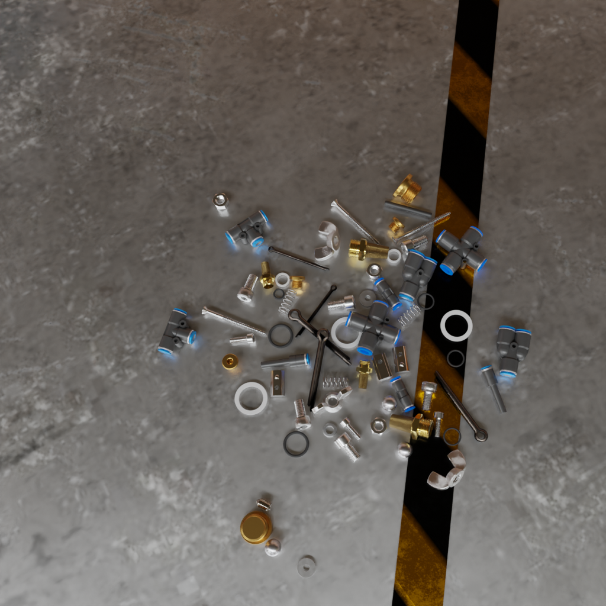
    
</p>

## Overview

**SynthRender** is a project for simplify and automate the creation and annotation of industrial datasets. It leverages the render engine of blender `cycles` for creating synthetic photorealistic images with just the CAD models of industrial pieces.

This pipeline can create `segmentation masks`, `depth images` and `normal maps` along with the rendered `rgb images`. This result can be automatically annotated in the COCO format or tuned into a YOLO dataset for latter training.

In order to work, a config_template.yaml with all the possible options is given.

## Citation
J. M. Araya-Martinez, T. Tom, A. S. Reig, P. R. Valiente, J. Lambrecht, and J. Krüger, 
“Synthrender and iris: Open-source framework and dataset for bidirectional sim-real transfer in industrial object perception,”
2026. [Online]. Available: https://arxiv.org/abs/2602.21141

## Quick Start

First, clone this repository to your local machine.

(*Note: A separated environment for avoiding dependence issues is recommended. The project has been tested with python version >= 3.11*)

Once the repository has been cloned, install the repository as an editable module to keep working with it and the dependencies listed in the requirements.txt file. Lastly, install the needed dependencies for blender using the `install_package.py` script:

```bash
cd Synthetic_Data/
pip install -r requirements.txt
pip install -e .
blenderproc run install_package.py
```

After that, you can check if your BlenderProc installation works by running the following command:

```bash
blenderproc quickstart
blenderproc vis hdf5 output/0.hdf5
```

This will render a monkey face and export a hdf5 file with it. If you can see it, then you are ready to go.

<p align="center">
    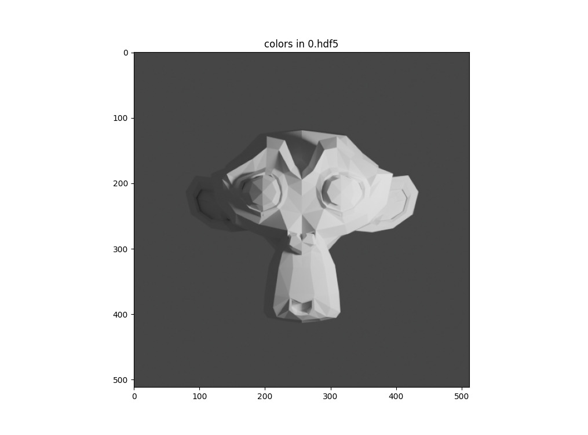
</p>

### Relevant BlenderProc commands

This project uses the module BlenderProc2 from DLR and their documentaion is worth reading for better understanding how this project works (<a href="docs/package.md">click here</a> for details).

In order to run a python script with blenderproc, we must replace `python` with `blenderproc run`, this will run blender with our script in headless mode. If the user needs to visualize the blender scene, replace "run" with "debug".

```bash
blenderproc <run/debug> <path_to_python_script>
```

Once a render has finished, by default all the data will be saved as a hdf5 file per each frame. The data within this files can be easliy visualized by running (similar to the monkey face example above):

```bash
blenderproc vis hdf5 <path_to_hdf5_file>
```

## Detailed Usage

The main scripts of this project are:

* **main.py**: Renders and annotates the data automatically.
* **scripts/create_synthetic_data.py**: Renders data and stores it as hdf5 and/or raw files.
* **scripts/parallel_blenderproc.py**: Runs an separate instance `create_synthetic_data.py` on each GPU for faster rendering.
* **scripts/annotate_synthetic_data.py**: Annotates the hdf5 files as COCO or BOP format and/or creates a YOLO dataset with it.
* **scripts/vis_data.py**: Simplified version of the `blenderproc vis` command.

A more detailed description of how each of this scripts work can be found below.

### Running main.py script

For rendering and creating the needed annotations one just has to call the `main.py` script. This will create one *(or many, depending on the [-g] parameter, if set)* instance of **scripts/create_synthetic_data.py** for rendering all the data as hdf5 files. Once it has finished, it will call the **scripts/annotate_synthetic_data.py** script for creating the needed annotations.

The script accepts the following parameters

* **-n** (number of frames to render): Number of frames that the pipeline will render.
* **-c** (path to config file): Path to the config file used for adjusting the pipeline (see `config_template.yaml` file)  
* **-g** (number of available gpus): The script will uniformly split the frames to render into `g` intervals, each running on their own dedicated GPU.
* **-dc** (do coco): Whether to annotate the result with the COCO format.
* **-db** (do bop): Whether to annotate the result with the BOP format.
* **-ty** (to yolo): Whether to turn toe COCO annotations into a YOLO dataset.

```bash
python main.py -n <number_frames> [-c <config_file_path>] [-g <number_of_GPUs>] [-dc] [-db] [-ty]
```

### Running create_synthetic_data.py script

It is also possible to just run parts of the pipeline rather than all of them at the same time with `main.py`. While setting up a desired simulation we can test both the rendering and how the keyframes are created, which is bery useful for debugging purposes.

If the option is set to debug, it will show the keyframed simulation in blender (see the yellow dots at the bottom of the image). Keyframes in blender are properties which value has been associated to a specific frame. Some propertiess are objects locations/rotations, light energy, render visibility, etc.

Furthermore, rendering will be also done if the `-s` and `-e` are set. This is because of all the generated keyframes, we may be interested in rendering only within a specific interval (this is also useful for parallelised runs).

```bash
blenderproc <debug/run> scripts/create_synthetic_data.py -n <number_keyframes> [-c <config_path>] [-s <render_start-frame>] [-e <render_stop-frame>]
```

<p align="center">
    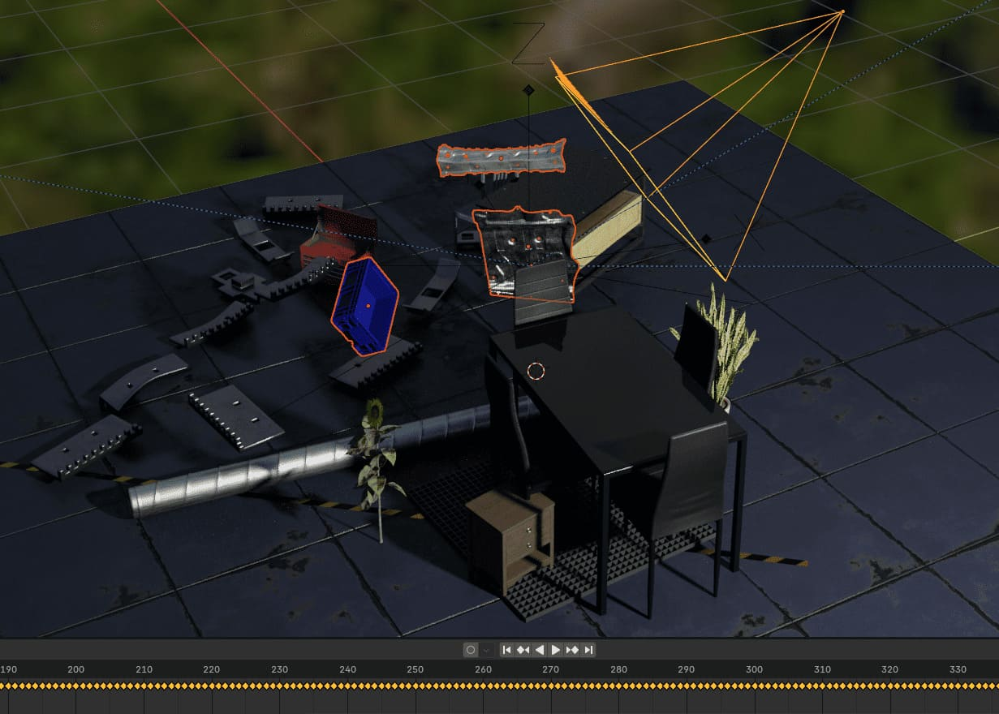
</p>

### Running parallel_blenderproc.py script

This script is a parallelised version of the previous one. Wherein `g` instances of create_synthetic_data.py are run, each on a different GPU. In order to avoid each instance to repeat the calculations of the same keyframes, each GPU renders only within a specific interval, which is the result of splitting the original render interval into `g` smaller intervals.

```bash
python scripts/parallel_blenderproc.py -n <number_frames> [-c <config_file_path>] [-s <render_start-frame>] [-e <render_stop-frame>] [-g <number_gpus>]
```

Below is an example of how it looks if the script is called with `-n 100` and `-g 4`. As can be seen, it splits the 100 frames in four intervals, leaving each GPU in charge of rendering only its respective section.

<p align="center">
  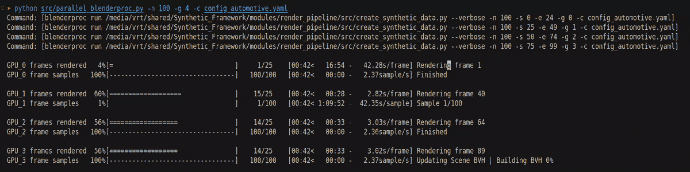
</p>

### Running annotate_synthetic_data.py script

This script will create annotations in COCO and/or BOP format for all the rendered hdf5 files. Moreover, it can turn COCO annotations into a YOLO dataset creating a `train` and `val` with a 80/20 split. Arguments `dc`, `db` and `ty` are the same as the ones explained for main.py.

```bash
blenderproc run scripts/annotate_synthetic_data.py [-c <config_file_path>] [-dc] [-db] [-ty]
```

### Running vis_data.py script

This script can be used for visualizing the content of the generated hdf5 files or COCO annotations. It will take the output path for the hdf5 and COCO fiels from the config_file and use it for visualizing the data of a specific frame

```bash
python scripts/vis_data.py <hdf5/coco> <frame> [-c config_path]
```

<p align="center">
    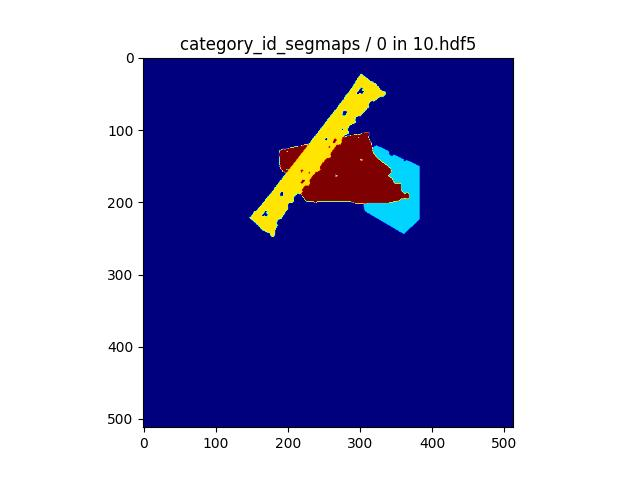
    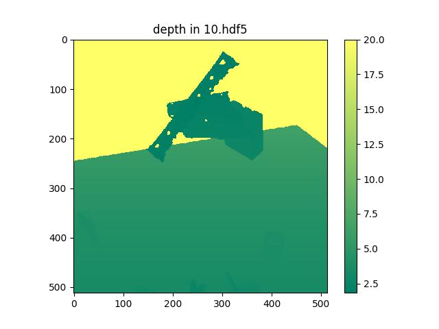
    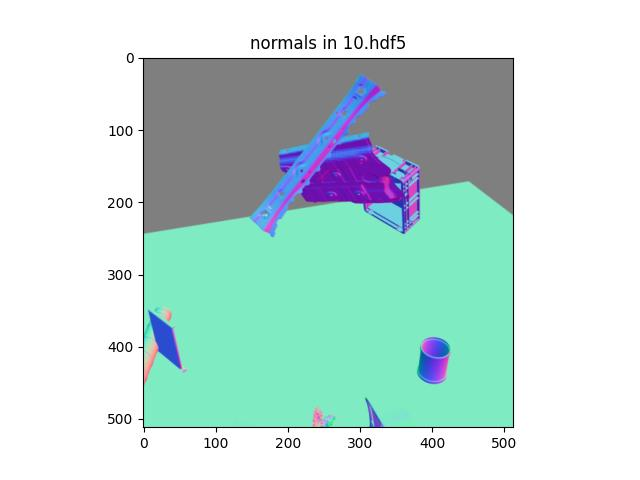
    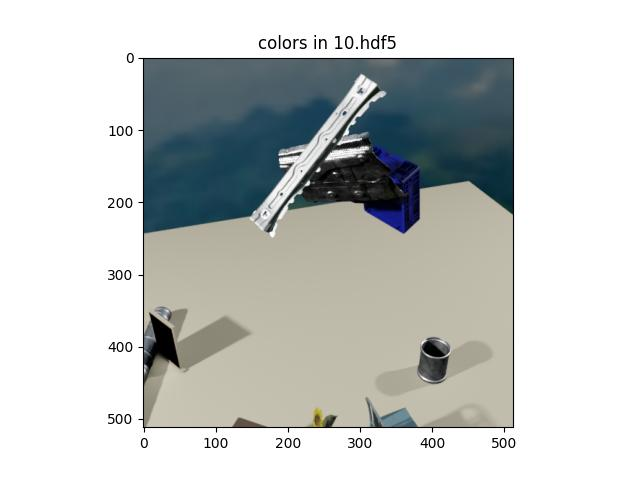
    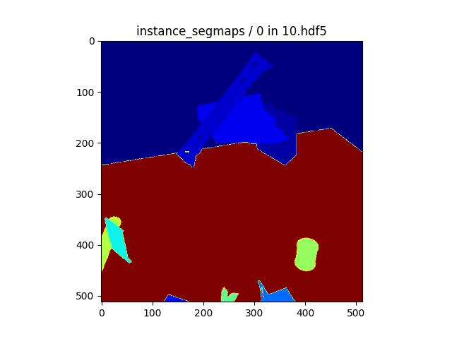
</p>

## Examples

### Template example

For running  an example of the the project, run:

```bash
blenderproc debug src/create_synthetic_data.py -n 100 -c config_template.yaml
```

That will create 100 keyframes in blender. We can visualize how they look like since the script has been run with the `debug` option:

<p align="center">
    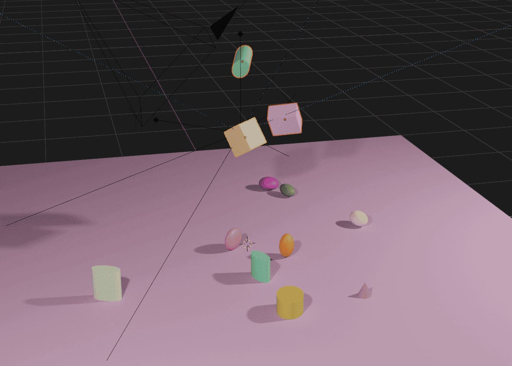
    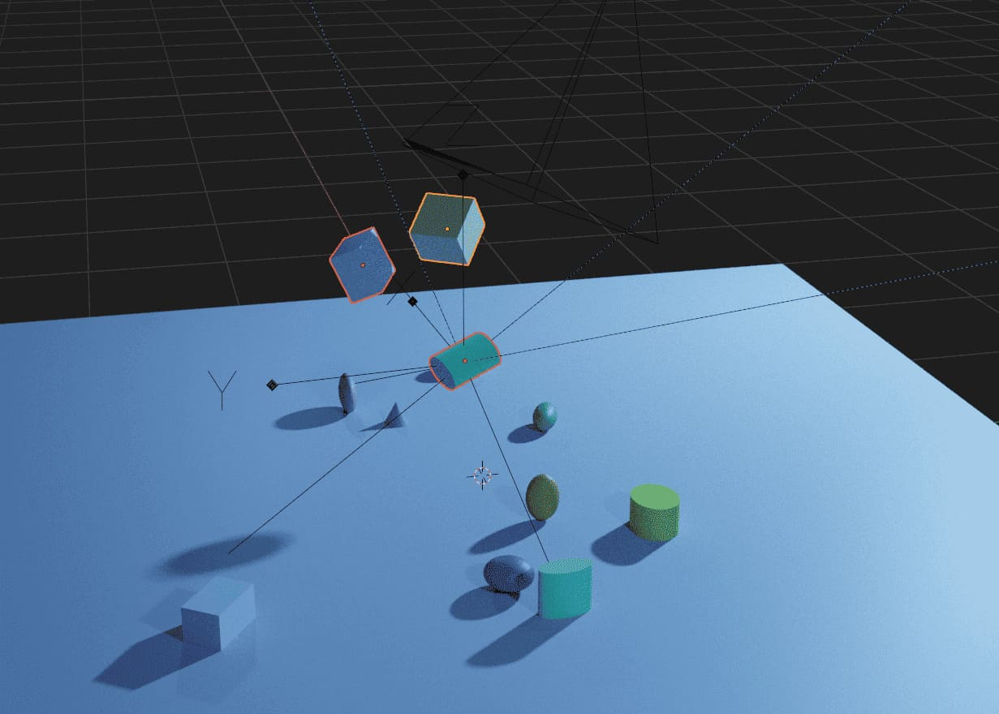
</p>

*Note: In the config file there is a line setting a seed for the random instructions. It can be set to -1 for getting real pseudo random results.*

### Physics example

The pipeline can also activate physic simulations for the loaded models. First create a copy of the `config_template.yaml` (we will just call it config.yaml from now on) and set "simulate_physics: False"  to True.

<p align="center">
    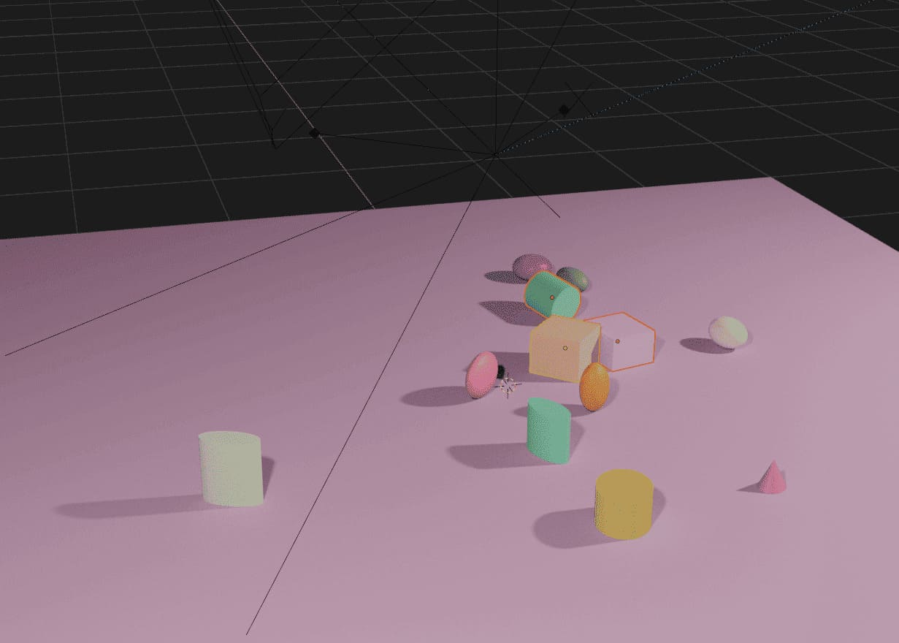
    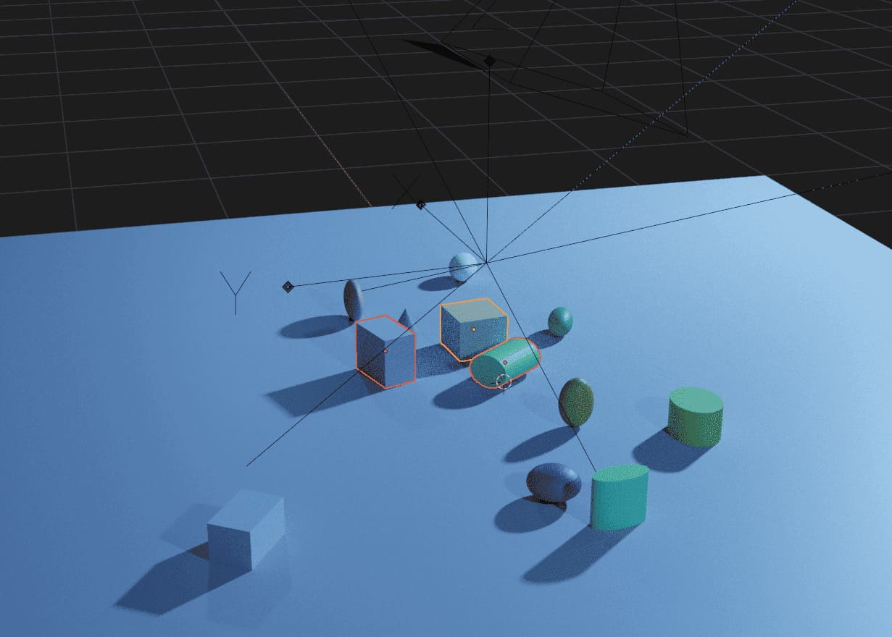
</p>

### Animation example

<p align="center">
    
</p>

## Contact
For questions, please contact the corresponding authors of the paper.
