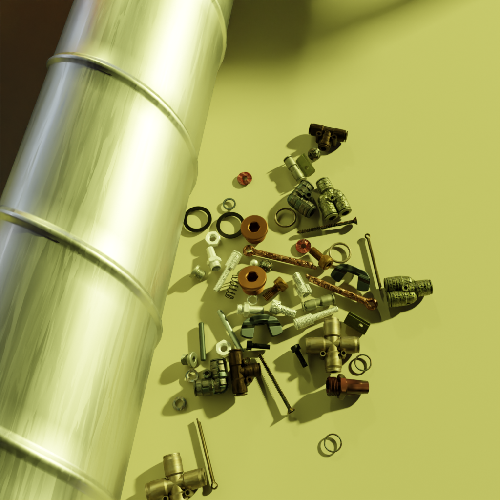
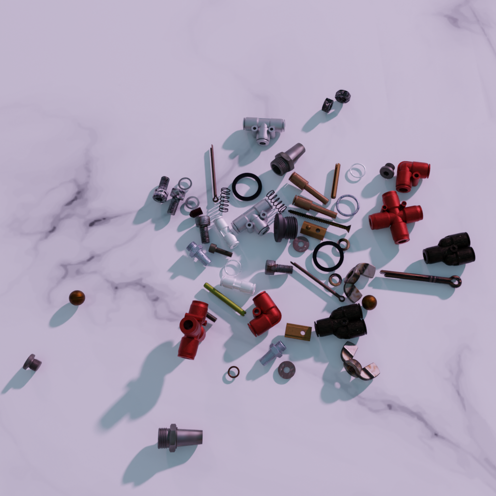

# SynthRender (Experimental Branch)

<p align="center">
    
    
</p>

## Overview

**SynthRender** is a project for simplify and automate the creation and annotation of industrial datasets. It leverages the render engine of blender `cycles` for creating synthetic photorealistic images with just the CAD models of industrial pieces.

This pipeline can create `segmentation masks`, `depth images` and `normal maps` along with the rendered `rgb images`. This result can be automatically annotated in the COCO format or tuned into a YOLO dataset for latter training.

## Experimental branch
This branch contains all the functionalities from the main one and adds on top of it the experimental feature of texture randomization of target objects for domain randomization experiments.

_Note: This branch has only been tested on Linux and is not prepared to be used on Windows._

The config_template.yaml contains a new section called `material_randomization_options`, from which it is possible to control the behaviour of this randomization:
```yaml
material_randomization_options:
    material_limit: 200    
    assign_mode: "per_object"           # "per_object" or "shared_single"
    randomize_mapping: true             # random UV/box mapping transform per object
    mapping_scale_range: [0.6, 1.8]     # uniform scale range
    mapping_rotation_range_deg: [-15, 15]  # per-axis degrees
    use_box_projection_if_no_uv: true
    box_blend: 0.15                     # soft edge for box projection
    use_ao_in_basecolor: true           # multiply AO into base color if present
    recurse: true
    max_depth: 4
    material_anim:
        enabled: true
        stride: 1           # keyframe every N frames (Blender interpolates in between)
        ranges:
            roughness: [0.15, 0.85]
            metallic:  [0.0,  0.9]
            specular:  [0.1,  0.5]
```

### PBR textures used

The textures used for the experiments are the ones from the <a href="cc0textures.com">cc0textures.com</a>, and can be downloaded after having installed blenderproc with the following command:

```bash
blenderproc download cc_textures <output_dir>
```

The maximum ammount of PBRs that can be used for the randomization is set to 200 in the config_template.yaml. However, it is recommended to adjust it depending on the available VRAM.
